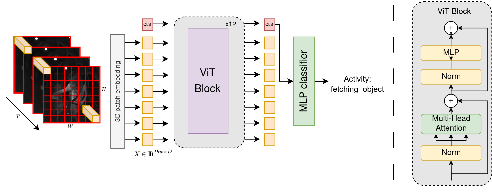

## DRVMon-VM: Distracted Driver Recognition Using Large Pre-Trained Video Transformers
This is the official repository to the paper "DRVMon-VM: Distracted Driver Recognition Using Large Pre-Trained Video Transformers". This repository contains the code to train and evaluate the models presented in the paper. 

This paper was presented at [IEEE IV 2024](https://ieee-iv.org/2024/) and can be found [here](https://events.infovaya.com/presentation?id=125218).

### Abstract

Recent advancements in video transformers have significantly impacted the field of human action recognition. Leveraging these models for distracted driver action recognition could potentially revolutionize road safety measures and enhance Human-Machine Interaction (HMI) technologies. A factor that limits their potential use is the need for extensive data for model training. In this paper, we propose DRVMon-VM, a novel approach for the recognition of distracted driver actions. This is based on a large pre-trained video transformer called VideoMaeV2 (backbone) and a classification head as decoder, which are fine-tuned using a dual learning rate strategy and a medium-sized driver actions database complemented by various data augmentation techniques. Our proposed model exhibits a substantial improvement, exceeding previous results by 7.34\% on the challenging Drive\&Act dataset, thereby setting a new benchmark in this field.

*Fig: DRVMon-VM backbone. An input video clip is tokenized via a 3D patch embedding layer and a class token (CLS) is concatenated to the sequence. The generated tokens are subsequently processed by the ViT-base model. The number and dimensions of the tokens remain constant throughout the network. The output classification token is decoded in a classifier to obtain the resulting label.*
## Changelog 
14/06/2024: Initial Release

## To Do
Release weights and guide to train and evaluate the models.